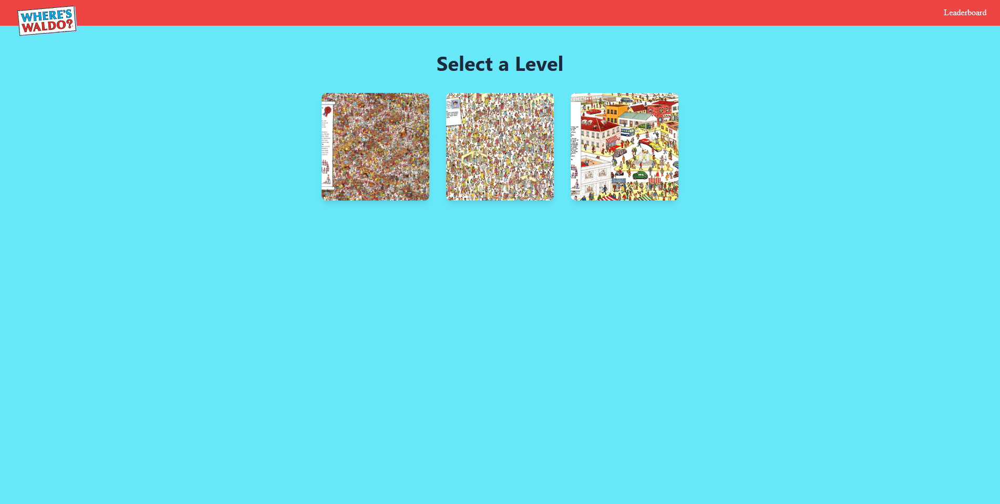
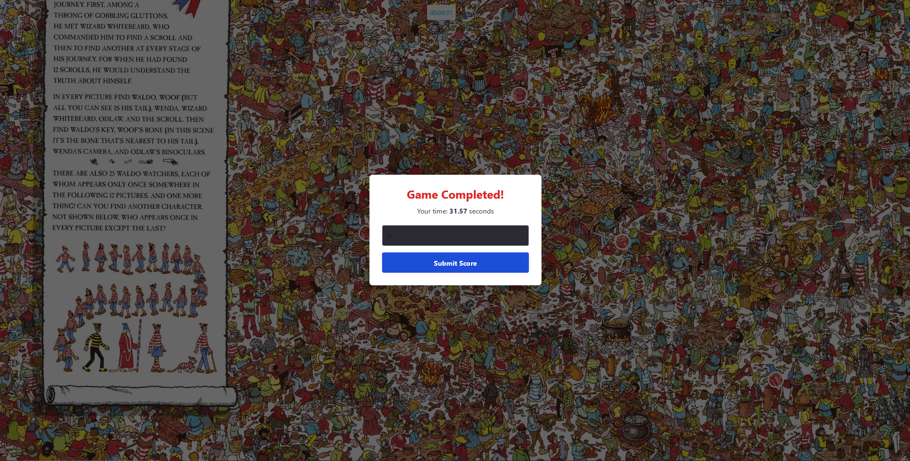
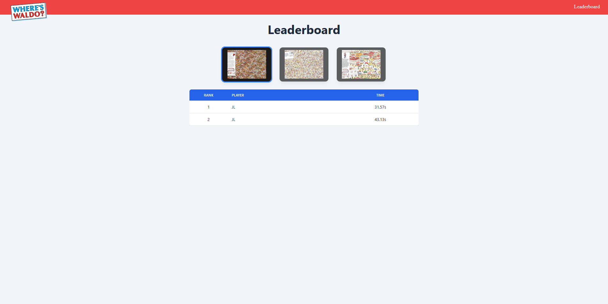

# 🎯 Where's Waldo (Photo Tagging App)

This is a full-stack photo tagging game inspired by the classic "Where's Waldo?" books. The project was built as part of The Odin Project's full-stack curriculum.

The app features a React/Tailwind frontend, a Node.js/Express backend, and a MongoDB database to store character locations and high scores.
---

## 📸 Screenshots & Demo

A quick demonstration of the core gameplay loop, from selection to feedback.

*(Place your `gameplay-demo.gif` here)*

| Level Selection | Game Completed | Leaderboard |
| :---: | :---: | :---: |
|  |  |  |
|  |  |  |

---

## ✨ Features

* **Level Selection:** Users can choose from multiple "Where's Waldo" images to play.
* **Photo Tagging:** Click anywhere on the image to bring up a targeting box and a dropdown of characters to find.
* **Backend Validation:** All coordinate checks are processed securely on the backend to prevent cheating.
* **Instant Feedback:** The targeting box provides immediate visual and audio feedback:
    * **Correct:** A green flash, a "pop-in" marker, and a success sound.
    * **Incorrect:** A red flash, a "shake" animation, and a wrong-guess sound.
* **Game Timer:** A server-side timer starts when the level loads and stops when the last character is found.
* **Leaderboards:** A modal prompts the user to submit their name to the high-score table upon completion.
* **Dynamic Leaderboard:** Players can view the top scores for each level, with data fetched from the database.

---

## 💻 Tech Stack

| Area | Technology |
| :--- | :--- |
| **Frontend** | React, React Router, Tailwind CSS, Axios |
| **Backend** | Node.js, Express, Mongoose, CORS |
| **Database** | MongoDB (with MongoDB Atlas) |
| **Dev Tools** | Vite, Nodemon |
